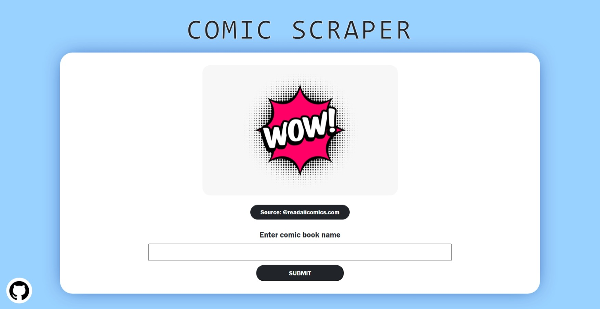
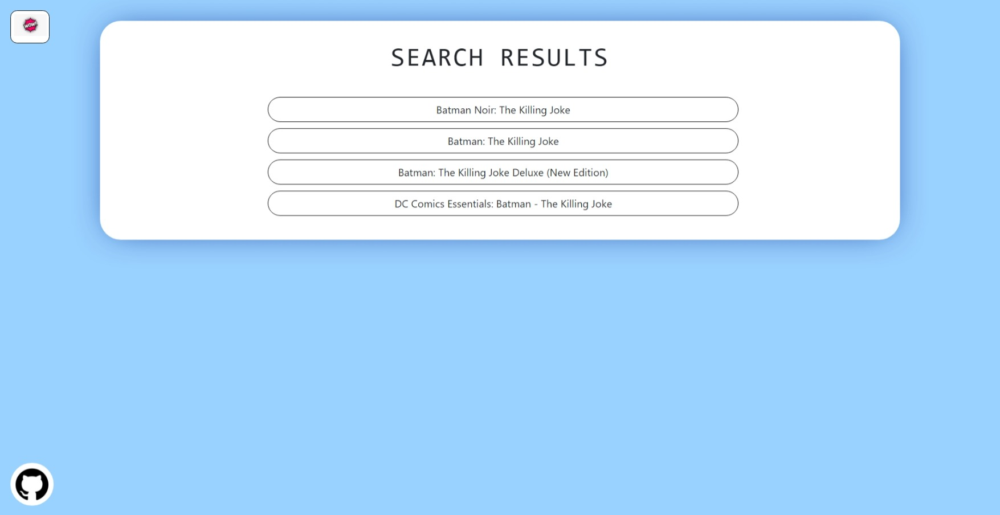
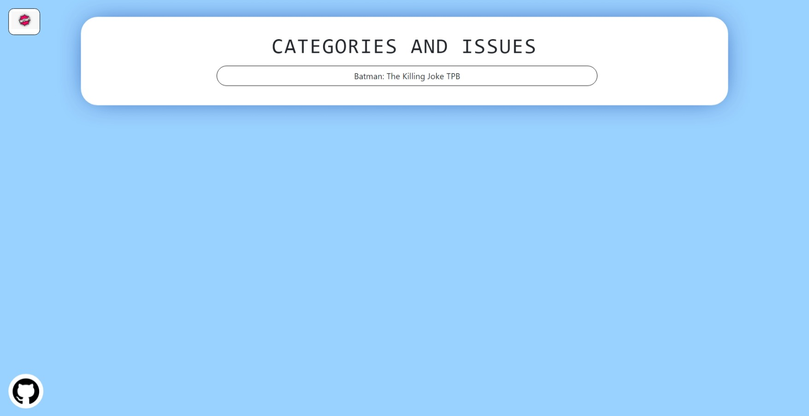
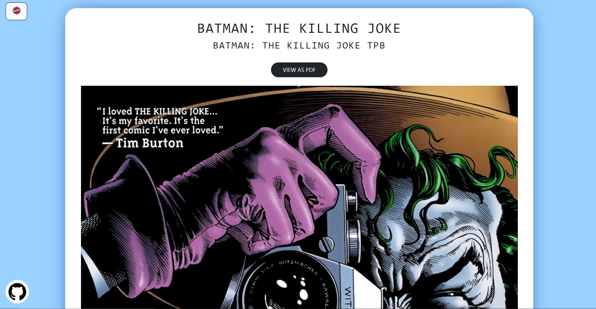
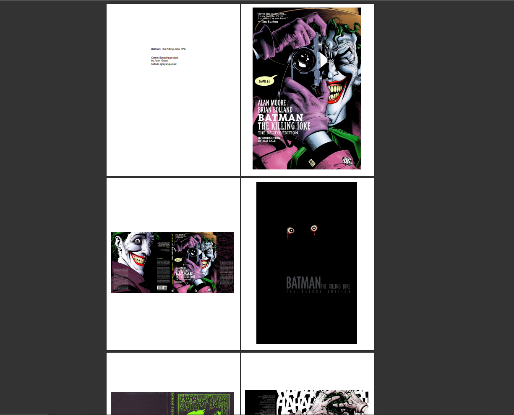

# COMIC SCRAPING PROJECT (WEB BASED)

## DISCLAIMER
This project has been developed for **EDUCATIONAL PURPOSE** only i.e to showcase scraping abilities with NODE JS

### DESCRIPTION
The comic scraping project (*web based*) provides functionality to search comics, scrapes them from [readallcomics.com](http://readallcomics.com) and presents them on the webpage. 
The project also provides a functionality to view the comics in pdf format and further save them on your personal machine.    

### SCREENSHOTS

